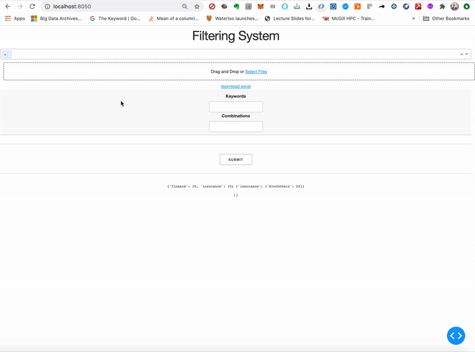

# Keyword Search App
Tired of searching through your giant excel database? Well this web app will help with what you're looking for!

## Instructions

1. Drag and drop Excel/CSV file 
2. Select the columns you want to search.
3. Input a score associated with each keyword. If applicable you may also input combinations of words that only scores when both words are present.
4. Click submit 
5. Download Excel

## Demo

## Features

* Interactive: See the data you're working with. Once you upload a file, the app will a show sample of the data! 
* Customizable: Select custom columns to search on. Also provide your own scores for each keyword!
* Download your results: Get your results instantly!

Example query:
 
Keywords: Finance:10, Insurance:20
 
Combinations: (Insurance:{Blockchain:10})
